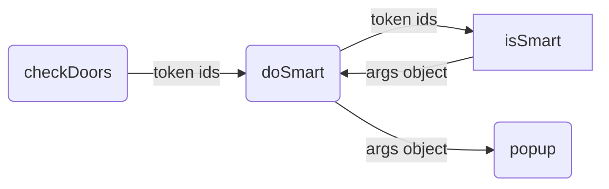
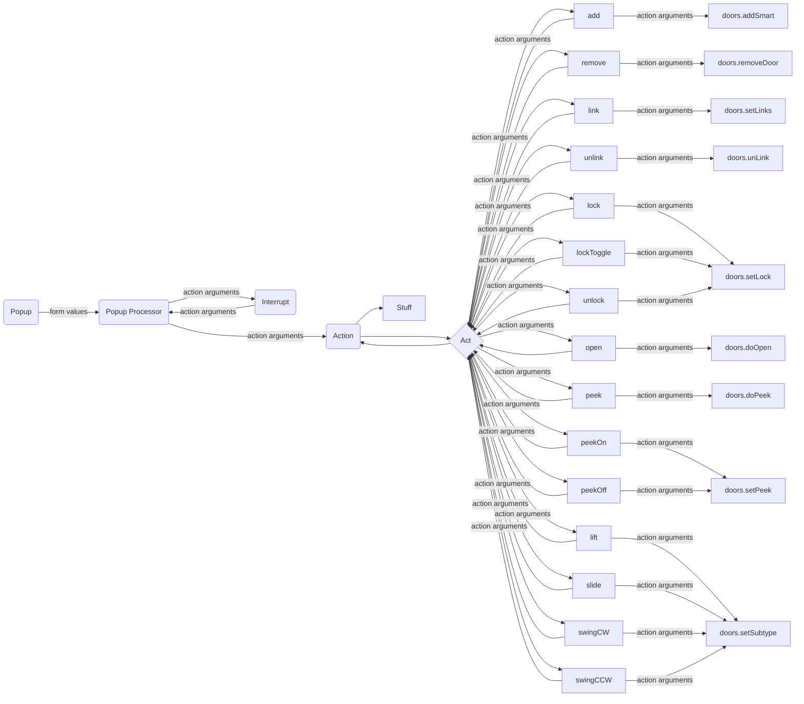

Smart Door Processing Chain

Smart door processing commences at **doSmart(tokenIds)**
- Close the Smart door control overlay on all clients (only one person at a time can operate a door to avoid bad things happening).
- Use passed arguments or collate arguments to pass for selected doors using **doors.isSmart(tokenIds)**.
- **doors.isSmart(tokenIds)** returns either 0 (i.e. false) or a JSON object containing door token IDs as keys with individual door settings as JSON objects for values.
- If the value returned was a JSON object, launch the control overlay **doors.popup(vArgs)**.

- **doors.popup(vArgs)**
  - Stop if more or less than one door selected.
  - Stop if editor is visible.
  - Get icons.
  - Send args for cleaning.
  - Get pinned condition.
  - Initialise variables with defaults.
  - Overwrite variables with door settings.
  - Use context to set icon visibility.
  - If options reduced to one;
    - set *skipPopup* flag,
    - add arguments for processing,
    - call **popupProcessor**.
  - else create control overlay.
- **popupProcessor**
  - switch on *action* value. Either set properties or set new value for action and update values in args for next step.
    - "pin"       (set pinned property true)
    - "pinned"    (set pinned property false)
    - "switch"    (toggle open)
    - "close"  
    - "open"      (open all the way)
    - "open1"     (open a little bit)
    - "open2"     (open more than a little bit)
    - "lock"      (set locked condition true)
    - "peek"      (toggle peek condition)
    - "secret"    (move to hidden layer)
    - "notsecret" (move to token layer)
    - "settings"  (open settings dialogue)
    - "unlock"    (set locked condition false)
    - "visible"   (set visible to players true)
    - "hidden"    (set visible to players false)
  - call **doors.interrupt(vArgs)**
    - **doors.interrupt(vArgs)** is a placeholder to allow users to insert their own calls and code. For instance, you could make a skill check to pick the lock, set off a trap, or any other funkyness.
  - pass args to **doors.action(vArgs)**
- **doors.action(vArgs)**
  - Where there are linked doors - for certain actions - prompt if action should be applied to linked doors
  - Loop through token ids, switch on *action* value.
    - "add"       : doors.addSmart(tokId)
    - "remove"    : doors.removeDoor(tokIds)
    - "link"      : doors.setLinks(tokIds)
    - "unlink"    : doors.unLink(tokIds)
    - "lock"      : doors.setLock(linkedTok, 1)
    - "lockToggle": doors.setLock(linkedTok)
    - "unlock"    : doors.setLock(linkedTok, 0)
    - "open"      : set openToAmount, playSound and a bunch of other stuff, doors.doOpen(linkedTok, json.get(linkedToks, linkedTok))
    - "peek"      : doors.doPeek(tokId, vSettings)
    - "peekOn"    : doors.setPeek(linkedTok, 1)
    - "peekOff"   : doors.setPeek(linkedTok, 0)
    - "lift"      : doors.setSubtype(linkedTok, "lift")
    - "slide"     : doors.setSubtype(linkedTok, "slide")
    - "swingCW"   : doors.setSubtype(linkedTok, "swingCW")
    - "swingCCW"  : doors.setSubtype(linkedTok, "swingCCW")
  - For "add" and "remove" set settings property with cleaned version.
  - Play sounds.
  - Expose FoW.
  - Deselect tokens
  - Refresh the GM panel "Door Controls"

